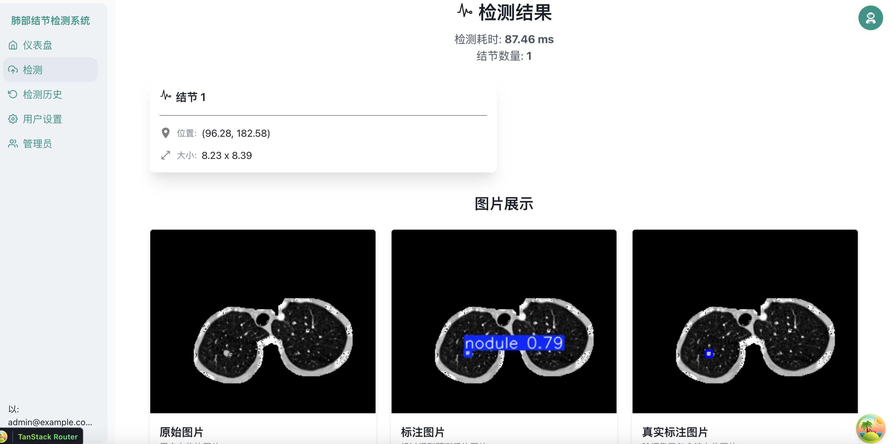
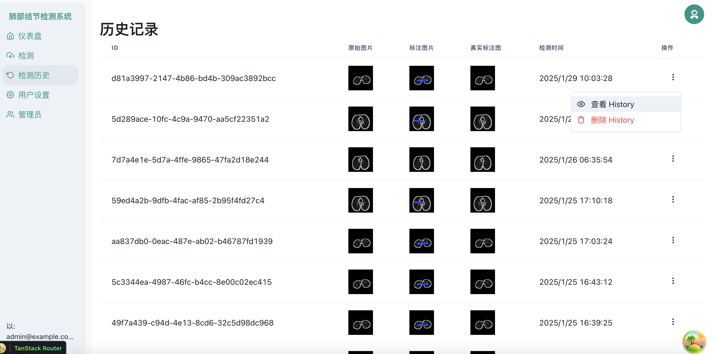
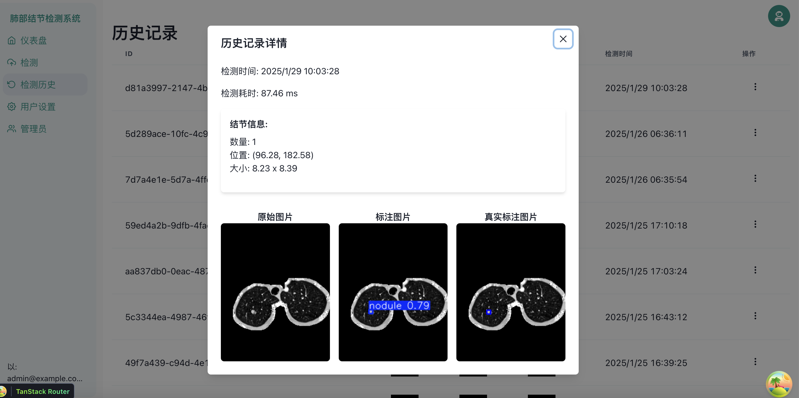

# LungNoduleDetect

## 目录

- [LungNoduleDetect](#lungnoduledetect)
  - [目录](#目录)
  - [介绍](#介绍)
    - [前端](#前端)
    - [后端](#后端)

## 介绍

### 前端

前端使用React+TypeScript， 由后端的OpenAPI文档自动生成客户端接口

检测页面设计如下：

历史记录：

### 后端

新增Redis服务器和对象存储MinIO